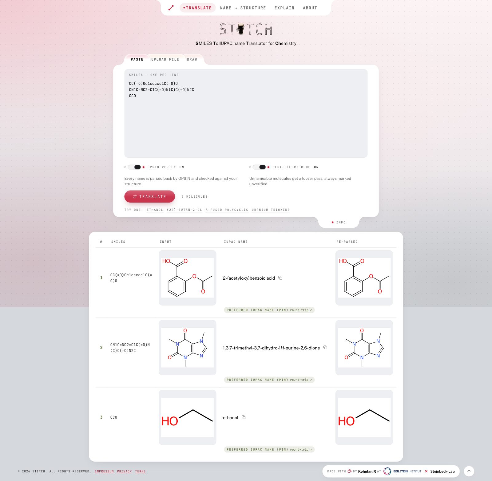
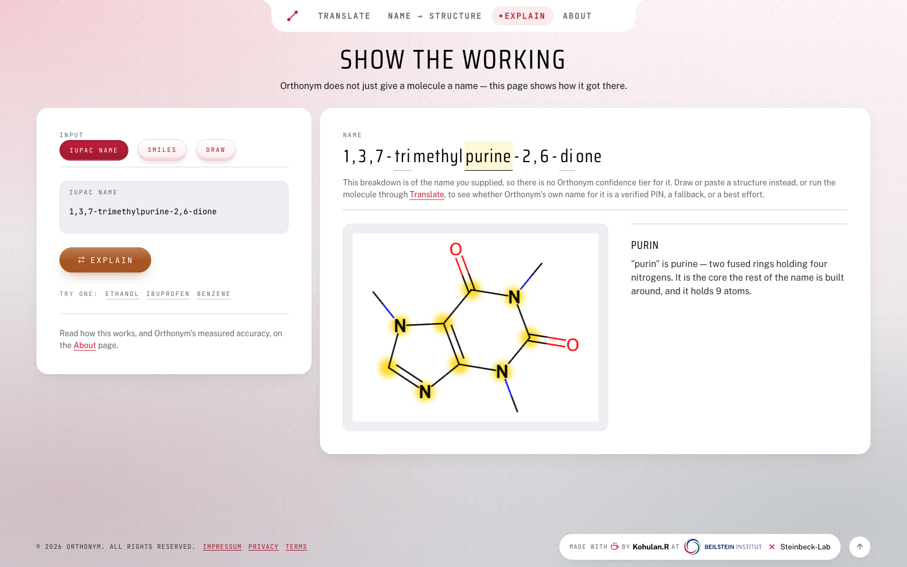

<div align="center">

<picture>
  <source media="(prefers-color-scheme: dark)" srcset="docs/screenshots/logo-dark.png">
  
</picture>

### Verified IUPAC names for Chemical Structures

**A chemical structure goes in. A IUPAC name comes out — with the confidence it has actually earned.**

[](LICENSE)


[**Install &amp; run**](INSTALL.md) · [Confidence tiers](#every-name-carries-its-receipt) · [What's inside](#whats-inside) · [API](INSTALL.md#the-batchjob-api)

</div>

---

## The problem

Most structure-to-name tools return a string and leave you to trust it. When a name is wrong, it
looks exactly like a name that is right.

Orthonym is built the other way round. It is powered by **Orthonym**, a deterministic, rule-based
naming engine — no neural network, no sampling, no temperature — and **every name it produces is
parsed back by [OPSIN](https://github.com/dan2097/opsin) and compared against the structure you
gave it.** What you see is the result of that check, stated plainly.

If the round-trip fails, Orthonym says so. If it cannot name a molecule at all, it declines rather
than guessing.

<div align="center">

</div>

## Every name carries its receipt

Five marks, and they appear wherever a name appears — never a footnote, never a word buried in a
column.

| Mark | Lamp | Tier | What it means |
|:--|:--|:--|:--|
| ▬▬ | ◉ green | **Preferred IUPAC name** | Worked to the strict rule, and read back clean. |
| ┄┄ | ◍ lime | **Fallback** | Reads back clean, but is not the preferred name. |
| ⋯⋯ | ◌ amber | **Best effort** | The engine worked it. OPSIN could not confirm it. |
| ── | ○ unlit | **Left unworked** | No name — it declined rather than guess. |
| ⊘ | ⊘ red | **Unreadable input** | Nothing to name: the structure could not be read. |

**The shape carries the ladder; the colour only agrees with it.** The lamp beside each mark is
neon, but its *form* is that tier's own rule — double, dashed, dotted, plain, struck — so the five
stay five in greyscale and to a reader with any of the three common colour deficiencies. That is
not a preference: measured across the palette, adjacent steps of a pure green-to-red ramp separate
by as little as **1.03:1** under deuteranopia, which is no signal at all. Colour is reinforcement.
Nothing here is ever colour alone.

That distinction is the product. A tool that cannot tell you which of these you are holding has
not finished the job.

## Show the working

`/explain` takes a finished name apart and maps every fragment to the atoms it covers. Hover a
piece of the name; the atoms it accounts for light up.

<div align="center">

</div>

Anything it cannot place, it says so — the same rule as everywhere else.

## What's inside

| | |
|:--|:--|
| **Translate** | Paste, upload or draw a structure. Batches stream as a job with progress, and report their outcome by tier — how many were named, and which kind of miss the rest were. |
| **Name → Structure** | The reverse, on OPSIN — because reading a name is a different craft from writing one. |
| **Explain** | The breakdown above. |
| **About** | How it works, and a live health board for the service itself. |

Built on [Orthonym](#the-engine) · [OPSIN 2.9.0](https://github.com/dan2097/opsin) ·
[RDKit](https://www.rdkit.org/) · [CDK 2.12](https://cdk.github.io/) ·
[Ketcher](https://github.com/epam/ketcher) · FastAPI · Celery · Redis · React 19

## Quick start

```bash
docker compose up -d --build          # five containers: redis, backend, 2 workers, frontend
open http://localhost:8080
```

Wait for a worker to report a live JVM before testing — until one does, naming is refused
deliberately rather than answered without verification:

```bash
curl -s http://127.0.0.1:8000/api/health
# {"status":"OK","opsin":"available"}   <- ready
```

Full instructions, deployment, sizing and the job API: **[INSTALL.md](INSTALL.md)**.

## The engine

Orthonym is the web app. The naming engine, **Orthonym**, lives in its own repository and is **not
public** — so `backend/vendor/` is populated from a local checkout, and a fresh clone cannot name a
molecule until it is. See [The Orthonym dependency](INSTALL.md#the-orthonym-dependency).

Why this is not "STOUT-V2 in a browser": that neural model is a separate, unrelated project.
Nothing here samples, and nothing here is a language model.

## Licence

MIT — see [LICENSE](LICENSE). Bundled third-party components keep their own licences, two of them
under copyleft terms; the running site states all of them on its Terms page, and
`backend/vendor/cdk/NOTICE` records CDK's provenance and checksum.

<div align="center">
<br>
<sub>Made with ☕ by <a href="https://kohulanr.com">Kohulan Rajan</a> at the
<a href="https://www.beilstein-institut.de/en/">Beilstein-Institut</a> ✕
<a href="https://cheminf.uni-jena.de">Steinbeck Lab</a></sub>
</div>
