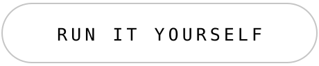
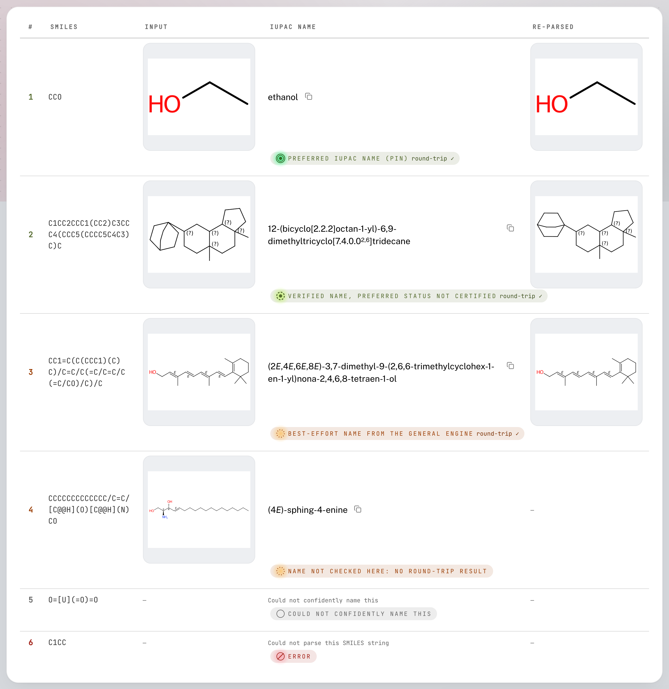
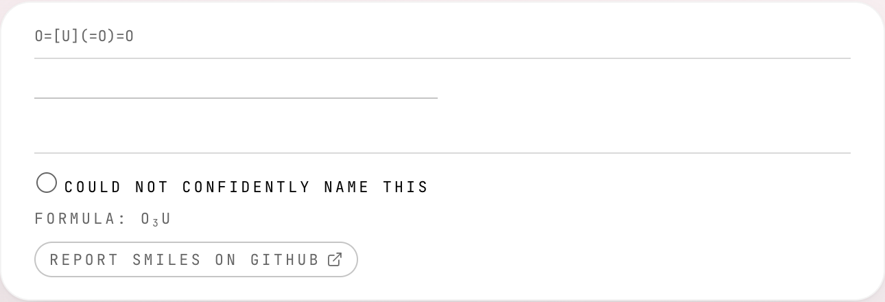
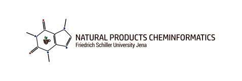

<div align="center">

<picture>
  <source media="(max-width: 700px)" srcset="docs/readme/banner-narrow.svg">
  
</picture>

<br>

<a href="https://orthonym.decimer.ai"></a>&nbsp;&nbsp;<a href="#run-it-yourself"></a>

<br>

**A chemical structure goes in. An IUPAC name comes out, with the confidence it has actually earned.**

[](LICENSE)
[](https://github.com/Steinbeck-Lab/Orthonym-Web/releases)
[](https://github.com/Steinbeck-Lab/Orthonym-Web/actions/workflows/ci.yml)

</div>

## How every name is checked

<picture>
  <source media="(max-width: 700px)" srcset="docs/readme/roundtrip-narrow.svg">
  
</picture>

**Deterministic.** Orthonym names structures with **the Orthonym engine**, which is rule-based:
no neural network, no sampling. The same structure always gets the same name.

**Checked.** Every name is handed to [OPSIN](https://github.com/dan2097/opsin), which never saw
your structure, and parsed back. The two structures are compared by full InChIKey, and the
result is shown next to the name.

**Honest.** The verdict lands on one of five tiers, drawn as a mark under the name wherever it
appears. The shape of the mark carries the tier and the colour only agrees, so the five stay five
in greyscale and for every common colour deficiency.

## See it working



<sub>Real results from the Translate page: one molecule for every state a result can be in.</sub>

<br><br>


<sub>Explain takes a name apart and lights the atoms each part describes. A part it cannot place is left unlit, never guessed.</sub>

## When it cannot name a molecule



It says so, and declines rather than guess. The card then offers **Report SMILES on GitHub**,
which opens a new issue here with the SMILES, the engine's reason and the settings already
filled in. The label names what leaves the page, and the privacy policy says exactly what the
link carries.

## What's inside

| Page | What it does |
|:--|:--|
| **Translate** | Paste SMILES, upload `.sdf`, `.mol` or `.csv`, or draw in Ketcher. Up to ten molecules answer at once; more run as a job with progress, a tally by tier and a CSV. |
| **Name → Structure** | The reverse, on OPSIN: a name in, a structure out. |
| **Explain** | A name taken apart; each part it can place is mapped onto its atoms, and the rest are marked, never guessed. |
| **About** | How a name is built and checked, and a live board of the service's health. |

Built on [the Orthonym engine](#the-engine) · [OPSIN 2.9.0](https://github.com/dan2097/opsin) ·
[RDKit](https://www.rdkit.org/) · [CDK 2.12](https://cdk.github.io/) ·
[Ketcher](https://github.com/epam/ketcher) · FastAPI · Celery · Redis · React 19

## Run it yourself

```bash
docker compose up -d --build        # redis, backend, two workers, frontend
open http://localhost:8080
```

Wait for a worker to report a live JVM. Until one does, Orthonym refuses to name anything, on
purpose: a name it cannot check is a name it will not serve.

```bash
curl -s http://127.0.0.1:8000/api/health
# {"status":"OK","opsin":"available"}
```

Deployment, sizing profiles and the batch-job API are in **[INSTALL.md](INSTALL.md)**.

## How to cite

A paper describing Orthonym is in preparation. Until it is published, please cite the software:
GitHub's **Cite this repository** button, built from [`CITATION.cff`](CITATION.cff), gives the
entry in APA and BibTeX, and lists the Orthonym engine it builds on.

## The engine

This repository, Orthonym-Web, is the web app. Its naming engine, **the Orthonym engine**, lives
in its own repository and is **not public**, so `backend/vendor/` is populated from a local
checkout and a fresh clone cannot name a molecule until it is. See
[the Orthonym engine dependency](INSTALL.md#the-orthonym-engine-dependency).

It is not STOUT-V2 in a browser: that neural model is a separate, unrelated project. Nothing here
samples, and nothing here is a language model.

## Licence

MIT, see [LICENSE](LICENSE). Bundled third-party components keep their own licences, two of them
under copyleft terms; the running site lists all of them on its Terms page, and
`backend/vendor/cdk/NOTICE` records CDK's provenance and checksum.

<div align="center">
<br>
<a href="https://www.beilstein-institut.de/en/"></a>

<a href="https://cheminf.uni-jena.de"></a>
<br>
<sub>Made with  by <a href="https://kohulanr.com">Kohulan Rajan</a>. An official collaboration for open science.</sub>
</div>
